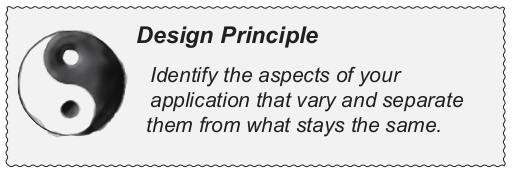

# Design Patterns

Resources 

Head First Design Pattern

[Design Patterns and Refactoring](https://sourcemaking.com/design_patterns)

[Design Patterns](https://refactoring.guru/design-patterns)

## OOP Basics

1. Abstraction → implementation of private/protected methods inside objects
2. Encapsulation → private/protected methods/variables + setters
3. Polymorphism →interface and abstract classes
4. Inheritance → subclass and super-classes

## OOP Principles

1. Encapsulate what varies: 
    
    take the parts that vary and encapsulate them, so that later you can alter or extend the parts that vary without affecting those that don’t.
    
    
    
2. composition over inheritance
    
    HAS-A can be better than IS-A
    
    composition is more dynamic than inheritance. so when you want dynamic behaviour (changing in runtime) use composition. when you want static behaviour use inheritance
    
    
    
3. program to interface, not to implement
    
    apply polymorphism
    
    
    
4. loosely coupled designs →flexible OO systems which can handle changes
    
    
    

# Design Patterns

1. Strategy
    
    separate the part of the code that varies, encapsulate them and use dependency injection for setting the strategy
    
    
    

1. Observer. some objects are observers (listeners) which will get notified when the subject is changed → kinda like dirty queues which make a loosely coupled system.
    
    observers can be updated by two ways:
    
    1. subject push the current data to the observers
    2. subject notify observers and they will pull the data from the subject
    
    
    

