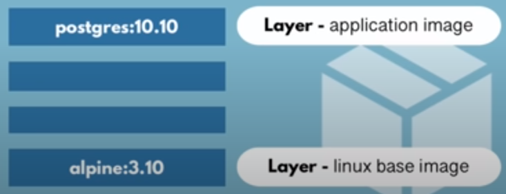
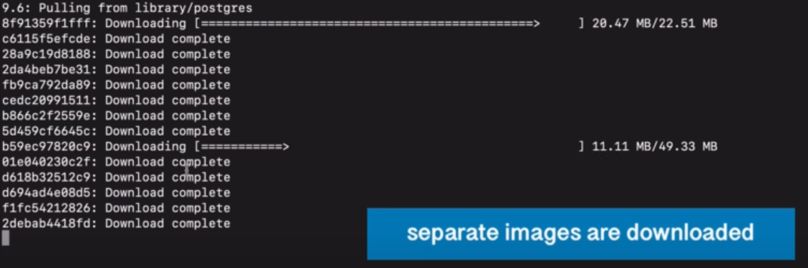
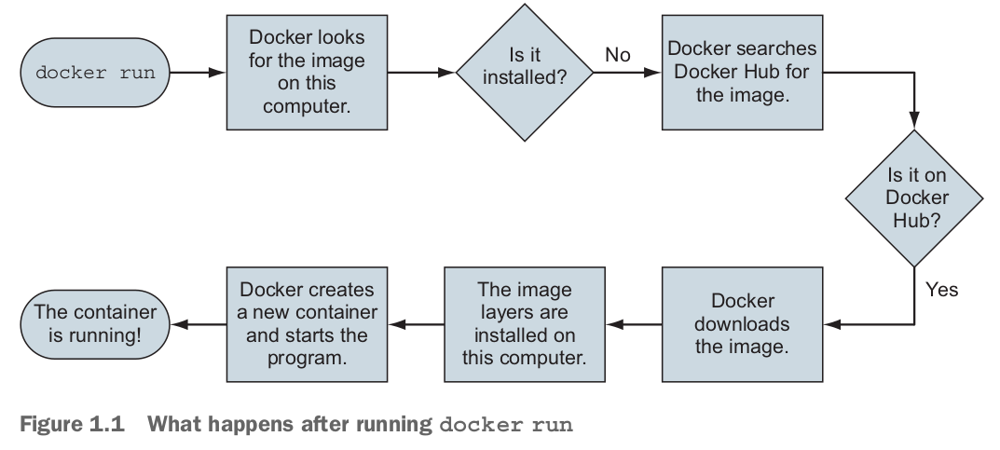
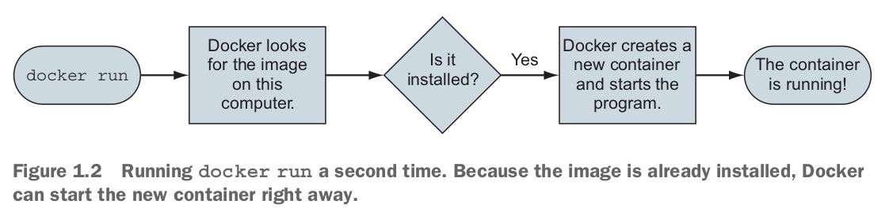
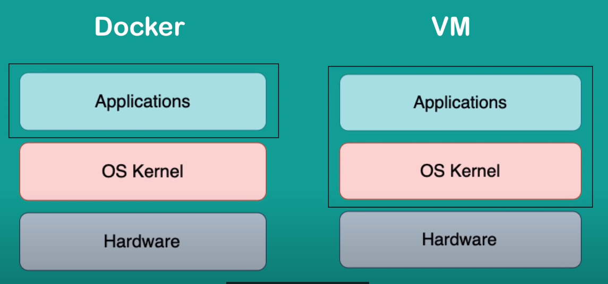
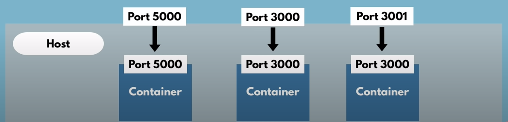
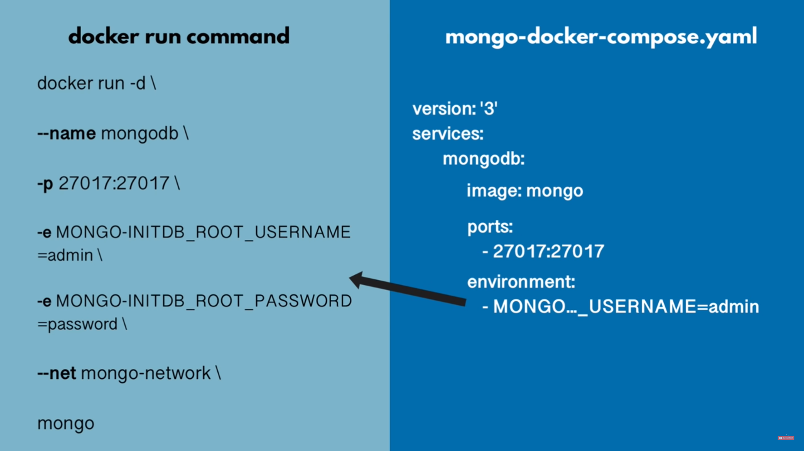
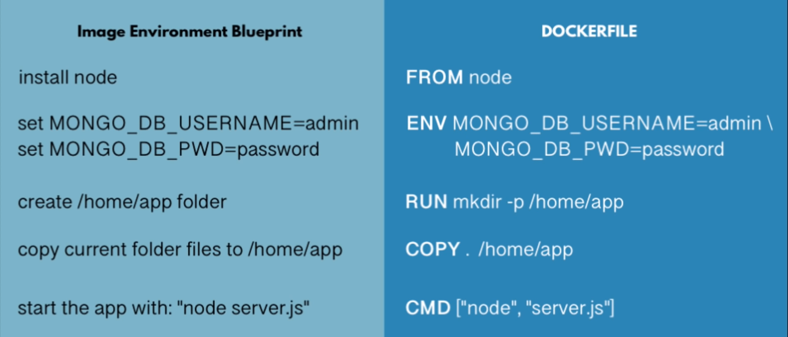
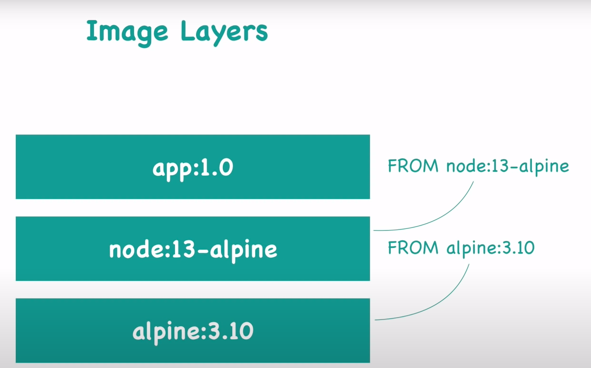

# Docker
main resources: 
- [ ] [youtube of nana](https://www.youtube.com/watch?v=3c-iBn73dDE&t=1756s)
- [ ] [youtube of jadi](https://www.youtube.com/watch?v=_jKNnHROiC0&t=806s)
- [ ] [youtube of data-engineering zoomcamp](https://www.youtube.com/watch?v=EYNwNlOrpr0&list=PL3MmuxUbc_hJed7dXYoJw8DoCuVHhGEQb)
- [ ] the docker book

usefully articles:
- https://opensource.com/resources/virtualization
- https://www.citrix.com/glossary/what-is-containerization.html
- https://docs.docker.com/get-started/
- https://github.com/wsargent/docker-cheat-sheet
- https://docker-curriculum.com/
- https://dev.to/signoz/docker-101-introduction-to-docker-1kbm

## Docker Basics
**what is Container**: a portable package of applications with all their dependencies and configurations which makes development easier.

container is a stack of images on top of each other. The OS (linux) image is at the button and the application image is at the top.



container repositories like [docker hub](https://hub.docker.com/) stores a lot of container images.

---
* get the image from docker hub
```commandline
docker pull imageName:version
```
after running this, all layers of the container will be downloaded



If layer exists locally, it will not get downloaded again (can occur in update image which only different layers will be downloaded) 

---
* creates a container from image, starts the container, if not found locally get the image from docker hub


```commandline
docker run imageName:version
docker run -d imageName
docker run --name containerName imageName:version
```
the `-d` runs the container in the detached mode

---
* see all running containers
```commandline
docker ps
docker ps -a
```
the `-a` will show all the running and stopped containers

### docker vs VMs
OS is made up of 2 layers, kernel and application.
The **main difference between docker and VMs** is that **docker virtualizes application layer and uses host's kernel** while **VMs virtualize both kernel and application layer**.



therefore:
1. size of docker is smaller than VM
2. docker containers are faster
3. linux based docker images are not compatible with the Windows kernel (should use docker toolbox for mac and Windows)

### container vs image
container is a running env for image

container consists of application image + file system + env configs

---
* see all existing images
```commandline
docker images
```
---
* start, stop and restart the container
```commandline
docker start containerId
docker stop containerId
docker restard containerId
```
`docker run` creates a container while `docker start` restarts a stopped container 

have in mind that when you restart the container, data will be lost and every configuration will be gone. Data is not persistent in containers unless you use **Volumes**.

### container port vs host port

in order to connect to a container, you should call the host port which is mapped to the container port
* run a container with binding host port to container port
```commandline
docker run -p hostPort:containerPort imageName
```
* see the logs of a container
```commandline
docker logs containerId
docker logs containerName | tail
```
`tail` is for showing the last logs
* **go to the terminal of the running container**
```commandline
docker exec -it containerId bash
docker exec -it containerName /bin/bash
docker exec -it containerName /bin/sh -u userName
```
which `-it` means iterative terminal and `-u` means to enter the terminal of which user

some containers don't have bash and should connect to shell instead

---

### docker network
all containers in a docker network can see each other using container name. 
all containers outside a docker network should call the container with its domain and port.
* see all docker networks
```commandline
docker network ls
```
* create a docker network
```commandline
docker network create networkName
```
* run a container in a docker network
```commandline
docker run --net networkName imageName
```
---

#### docker run command with all it's options:
```commandline
docker run -d \
    --network networkName \
    --name containerName \
    -p hostPort:containerPort \
    -e INVIRONMENTAL_VARIABLE_NAME = envVariableValue \
    imageName:tag
```
* `-d` is for detached mode
* `-e` is for environmental variables
* `-p` is for port

by running `env` inside the container (`docker exec -it containrId bin/bash`) you can see all the env variables.
## docker compose
instead of running multiple containers in terminal, docker compose automate the process by writing all configurations in a **YAML** file.

docker compose create a common network for all its containers 
* create and run containers (shot down containers) using docker compose
```commandline
docker-compose -f fileName.yml up
docker-compose -f fileName.yml down
```
`-f` is for file name
## Dockerfile
Dockerfile is a blueprint for building images.

* `FROM` Defines the base image to use and start the build process. means that the dockerfile is going to start by basing it on what image

  * each image is based on another image. image layers are all the images which are based on each other to build the final image
* `ENV` you can set env variables on dockerfile too, but it's preferred to have them on docker compose file
* `RUN` you can execute any linux command inside the container
* `COPY` copy files from the host machine  to the container and is different with `RUN cp` which runs on container
* `WORKDIR` set up the working directory inside the container
* `CMD` or `ENTRYPOINT` entrypoint command (you can have multiple `RUN`commands but only one `CMD`) which defines what should be run when running the image `docker run -it image:tag`

example Dockerfile
```dockerfile
# base Docker image that we will build on
FROM python:3.9.1

# set up our image by installing prerequisites; pandas in this case
RUN pip install pandas

# set up the working directory inside the container
WORKDIR /app
# copy the script to the container. 1st name is source file, 2nd is destination
COPY pipeline.py pipeline.py

# define what to do first when the container runs
# in this example, we will just run the script
ENTRYPOINT ["python", "pipeline.py"]
```

---
* create an image from Dockerfile
```commandline
docker build -t imageName:tagName DockerfilePath
```
and then you can run your image with `docker run imageName:tagName`
> what Jenkins do is that it create an image from the docker file and push the image to the docker repository. 
> 
> the image then can be pulled from docker repository to be run on local for development, test env or production 

in order to rebuild an image (when you changed the docker file), you have to delete to old image
* delete a container
```commandline
docker rm containerId
```
* remove an image
```commandline
docker rmi imageId
```
you can only delete an image when no container is using it.

---
### difference between **dockerfile** and **docker-compose**
- dockerfile is being used when we want to create a new image. 
- when you want to use an existing image (from docker hub) you don't need to create dockerfile 
- docker-compose is being used when you want to combine multiple containers and their config into a single file
- docker-compose holds all the configs you may need when running `docker run`
- docker-compose can consist of multiple containers. in docker desktop,  is the icon of container
and  is the icon of docker-compose

## Docker Volumes
use for data persistence (db containers)
we plug the physical system file path into the container file path
![[volumes.png]]

- building a container with volume
```
docker run -v hostPath:containerPath imageName
```
- specify the volume in docker-compose
```
services:
	service1:
		volumes:
			- name1:containerPath
	service2:
		volumes:
			- hostPath:containerPath

volumes:
	name1
```

there are three types of volumes which are:
1. host volumes `hostPath:containerPath`
2. anonymous volumes `containerPath`
3. named volumes `name:containerPath`

## commands cheat sheet
|command|use case|functionality|
|---|---|---|
|`docker pul`|🖼️ images|get the image from the docker hub|
|`docker run`|🖼️ images|get and create a container from image |
|`docker images`|🖼️ images|images list|
|`docker rmi`|🖼️ images|remove an image|
|`docker build`|🖼️ images|create an image from a Dockerfile|
|`docker start`|📦 containers|start the container|
|`docker stop`|📦 containers|stop the container|
|`docker restart`|📦 containers|restart the container|
|`docker ps`|📦 containers|containers list|
|`docker logs`|📦 containers|see logs of a container|
|`docker exec`|📦 containers|go to the container's terminal|
|`docker rm`|📦 containers|remove a container|
|`docker network ls`|🌐 network|networks list|
|`docker network create`|🌐 network|create a network|
|`docker-compose up`|🚢 docker-compose|create a docker-compose from docker-compose file|
|`docker-compose down`|🚢 docker-compose|remove the docker-compose|
|`docker-compose start`|🚢 docker-compose|start the created docker-compose|
|`docker-compose restart`|🚢 docker-compose|
|`docker-compose stop`|🚢 docker-compose|
