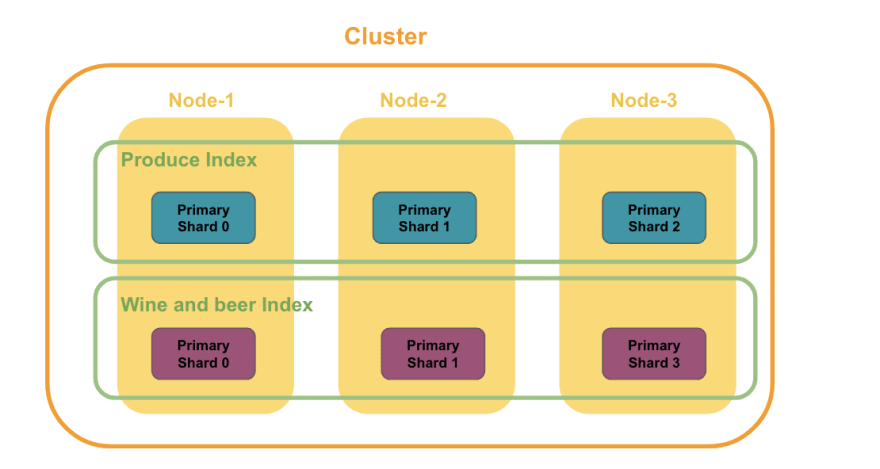

# elasticsearch

## Anatomy of HTTP request

1. Method (GET, POST, PUT, DELETE, *HEAD, PATCH, OPTIONS*)
2. protocol (*HTTP/1.1*)
3. host (*digikala.com*)
4. URL (*/ajax/cart/add*)
5. header (User-Agent, Content-Type, Accept-Language)
6. body

`curl -XPUT localhost:9200/test/_doc/124 -H "Content-Type: application/json" -d'`

`{`

`"name": "shayan"`

`}'`

## Terminology

document ← rows

index ← tables

mapping ←schema

$TF-IDF = term frequency / document frequency$

## Architecture

**node**: a running instance of Elasticsearch that stores data. It has a unique id and a name.

**cluster**: a collection of nodes that are connected together.

**shard**: where data of an index is actually stored in disk

$cluster > node > shard$




for read requests, it will redirect to a shard using the round-robin method which can be primary or replica shards

for write requests, however, it will redirect to only primary shards

# HTTP REQUESTS

## CRUD

---

base `GET /`

---

insert document`PUT /{indexName}/_doc/{docId}/`

```jsx
{
	data
}
```

- needs an id to insert the data

for inserting data without id use `POST /{indexName}/_doc/`

---

set mapping `PUT /{indexName)/?pretty`

```jsx
{
	"mappings": {
		"properties": {
				fieldName: {attributes}
		}
	}
}
```

---

get mapping `GET /{indexName}/_mapping?pretty`

---

get a document `GET /{indexName}/_doc/{docId}/`

---

full update `PUT /{indexName}/_doc/{docId}`

```jsx
{
	data
}
```

---

partial update  `POST /{indexName}/_doc/{docId}/_update`

```jsx
{
	"doc": {
		data
	}
}
```

---

delete `DELETE /{indexName}/_doc/{docId}`

---

insert many rows `PUT /_bulk/`

```jsx
{"create": {"_index": indexName, "_id": id}} {fields}
```

---

insert / update with handling concurrency issue

`PUT /{indexName}/_doc/{id}?if_seq_no={seqNum}&if_primary_term={primaryTerm}` 

`POST /{indexName}/_doc/{id}/_update?retry_on_conflict={numberOfTimesToTry}`

---

delete index `DELETE /{indexName}/`

## SEARCH

---

get all data `GET /{indexName}/_search?pretty`

---

query lite `GET /{indexName}/_search?q=`

`GET /{indexName}/_search?q=title:star`

`GET /{indexName}/_search?q=+year:>2010+title:trek`

---

json search `GET/{indexName}/_search`

```php
{
	"query": {}
}
```

# Mappings:


data type of texts fields with exact match: **keyword**

# Search

JSON search contains two parts:

1. Filter: boolean operations / Yes-No /  fast / cache-able / use as you can
2. query: return based on the relevance

> In the query context, a query clause answers the question “How well does this document match this query clause?” Besides deciding whether or not the document matches, **the query clause also calculates a relevance score in the _score metadata field**.
In a filter context, a query clause answers the question “*Does this document match this query clause?*” The answer is a simple **Yes or No — no scores are calculated**.
> 

### boolean terms:

1. must → (and) must fulfill all criteria
2. must_not →not
3. should →(or) documents with these criteria are more favorable and appear higher in search

> **Adding multiple queries under the should clause:** This approach ensures that you maintain a high recall but also offers a way to present more precise search results at the top of your search results.
> 

### Bool query (with pagination and sort)
```
GET {name_of_index}/_search?sort={fieldName}&pretty
{
  "query": {
    "bool": {
      "must": [
        {One or more queries can be specified here. A document MUST match all of these queries to be considered as a hit.}
      ],
      "must_not": [
        {A document must NOT match any of the queries specified here. It it does, it is excluded from the search results.}
      ],
      "should": [
        {A document does not have to match any queries specified here. However, it if it does match, this document is given a higher score.}
      ],
      "filter": [
        {These filters(queries) place documents in either yes or no category. Ones that fall into the yes category are included in the hits. }
      ]
    }
  },
	"from": like ofset // (pagination),
	"size": like limit // (pagination)
}
```

### types of filters and queries:

1. term `{"term": {"year": 2014}}` whether a term exists in a field or not (not being analyzed)
2. terms `{"terms": {"genre": ["comedy", "sci-fi"]}}` whether one of the terms exists in a field or not (not being analyzed)
3. match_all `{"match_all": {}}` 
4. match `{"match": {"title": "start"}}`like term but with analyzer
5. match_phrase `{"match_phrase": {"title": "star wars", "slop", 1}}` order is important
6. multi_match `{"multi_match": {"query": "Samsung", "fields": ["title_name_en", "brand_name_en"]}}`for multi fields (not like terms)
7. fuzzy `{"fuzzy": {"field": {"value": "shayn", "fuzziness" = 2}}}` based on Lenvenshtein edit distance
8. range `{"range": {"year": {"gte": 2010}}}` for numbers and dates
9. exists `{"exists": {"field": "tags"}}` IDK
10. missing `{"missing": {"field": "tags"}}` IDK

> unlike match, term does not use analyzers (like lowercase) so it only check if an term exists in a field or not
> 

### sorting:

cannot perform sorting for fields that are analyzed (text cannot be sorted but keyword can)

if you need to sort based on text which are analyzed you have to change the mapping like the following:

```
/{indexName}/
{
	"mappings": {
		"properties": {
			"{fieldName}": "text",
			"fields": {
				"raw": {
					"type": "keyword"
				}
			}
		}
	}
}
```

and use `/{indexName}/_search?sort={fieldName}.raw`

### Lenvenshtein edit distance


## Analyzers:


### Analyzer filters:

