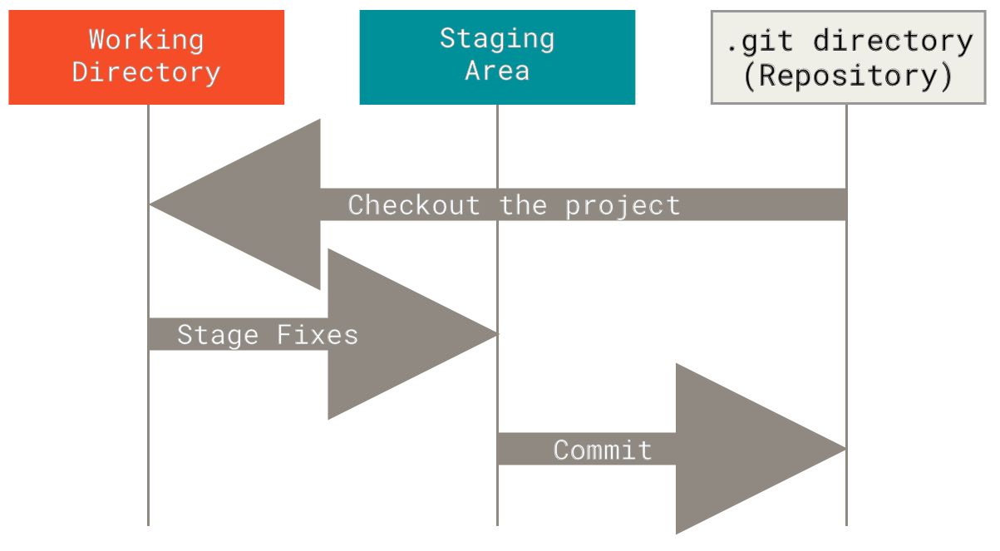

### sources: 
1. [Introduction to Git and GitHub](https://www.coursera.org/learn/introduction-git-github/)
2. ProGit book

# diff and patch
### diff

diff is used to find differences between two files. On its own, it’s a bit hard to use; instead, use it with diff -u to find lines which differ in two files:

### diff -u

diff -u is used to compare two files, line by line, and have the differing lines compared side-by-side in the same output. See below:

### Patch

Patch is useful for applying file differences. See the below example, which compares two files. The comparison is saved as a .diff file, which is then patched to the original file!

```
~$ diff -u file1.txt file2.txt > file_diff.diff
~$ patch file1 < file_diff.diff
```

There are some other interesting patch and diff commands such as patch -p1, diff -r !

# GIT basics
### the three states
1. working tree: a single checkout of one version (useally current version) of the project.
2. staging area (index): a file that contains all the info about what changes are going to go into the next commit
3. git repository: contains all the changes and the history of the project.



each file can be in one the follwoing states:
1. modified:changed file before moving them to staging area
2. staged: files that are ready to get commited to the git repo
3. commited: files in gir repo

### git configs:
```
git config --global user.name 'shayan'
git config --global user.email 'shayan@email.com'
git config -l
```
which `--global` will set this value for all repos.
you can use `--local` for specific repos to have different configs

### basic commands
```
git init
git clone repoLink
git add fileName
git status
git commit -m 'commit message'
git log
```
