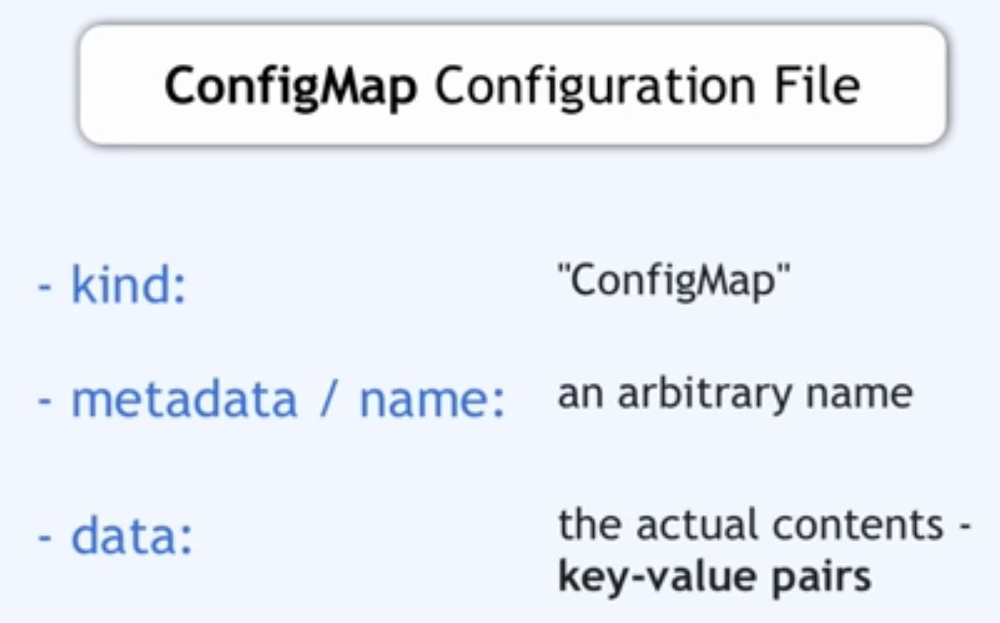

# KUBERNETES

## WHY

## Architecture

- worker node
    - also called node
    - has containers of different apps on it
    - **kubelet** process also is running on them which makes communication and running tasks on the cluster possible
    - high workload
    - need more resource
- master node
    - also called control plane node
    - at least one master node
    - runs kubernetes processes such as
        - API server: entry point to k8 cluster (UI, API, CLI -> kubectl)
        - controller manager: what happens in the cluster
        - scheduler: decides on which node the new pod should be scheduled
        - etcd: key value store
    - less resource is required
    - much more important that worker node -> have backup master node
- virtual network: makes communication between nodes possible


## Core Objects

**node**: server / computer

**pod**: smallest unit in k8. abstraction of a **container**

- docker container running on a node
- 1 app per pod
- each pod has an ip address
- if a pod crasher, the new recreated pod will have a new ip

**service**: a permanent ip address attached to a pod. it is also a **load balancer**

- entrypoint of an application
- routes requests to pods
- external service: open to access from out of the node (load balancer)
- internal service: cannot access it from outside the node (cluster ip)
- service can be connected to multiple pods

ingress: entrypoint of a cluster

- out requests of the node come to ingress, and it will forward the request to services

**config map**: external configs of your app -> plain text

- like urls of other services
- not good for passwords

**secrets**: config map for secret data and credentials -> base 64 encoding format

- credentials

**volume**: data storage, attaches a local/remote storage in hard drive to the pod

- if the data is stored in the pod, after restart it will be gone
- storage is something that is an external hard drive plugged in to he kubernetes cluster
- **kubernetes doesn't manage data persistence**

**deployment**: abstraction of a pod, a blu print of a pod which can be used to create any replication of the pod

- group of pods with the image and config
- you create deployments, not pods
- it will be used for stateless pods

**stateful set**: abstraction (ble print) of a data storage pod

- it will be used for stateful pods
- deploying stateful is not easy
- therefore, DBs are often hosted outside kubernetes cluster


## Kuber Configuration

each config consists of three parts:

1. metadata
2. specifications -> which is what is the _desired_
3. status -> will be generated by k8s showing what is _current_

- by comparing desired and current, k8s will update and change the cluster
- the current states comes from etcd which logs the current status of any k8s component
- in deployment config, there is a template which is the pod config itself, containing metadata and spec




## kubectl commands

- in order to create an object from a file

```shell
kubectl apply -f configFile.yml
```

- delete an object in a node

```shell
kubectl delete -f configFile.yml
```

- in order to see all objects of a specific type

```shell
kubectl get node
kubectl get all
kubectl get pod/configmap/secret
```

- in order to get some info about an object

```shell
kubectl describe objectType objectName
```

- connect to an object and call it using api

```shell
kubectl port-forwarding objectName hostPort:servicePort
```

- connect to an object and use its bash

```shell
kubectl exec -it objectName -- bash
```

sources:

- [x] [YouTube (crash course)](https://www.youtube.com/watch?v=s_o8dwzRlu4&t=2197s)
- [ ] [YouTube (zero to hero)](https://www.youtube.com/watch?v=s_o8dwzRlu4&t=2197s)
- [x] [ML zoomcamp](https://github.com/DataTalksClub/machine-learning-zoomcamp/tree/master/10-kubernetes)