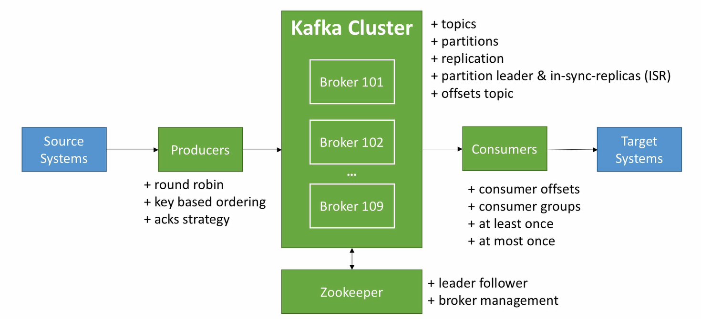
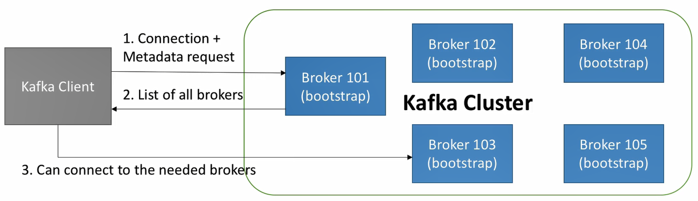
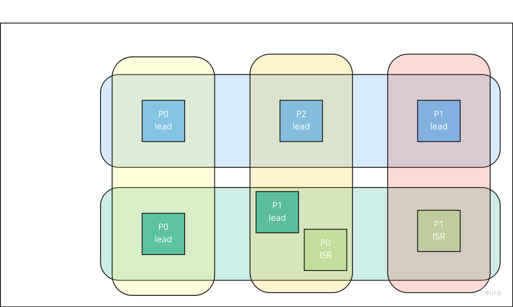
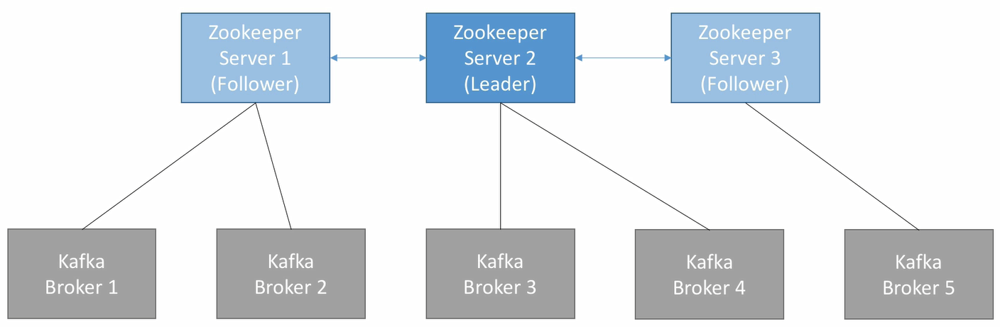
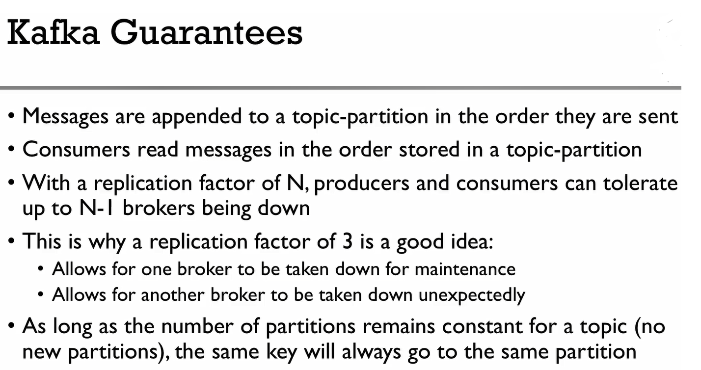

# Apache Kafka

#### resources:
1. [udemy course](https://www.udemy.com/course/apache-kafka/)
2. [Kafka: The Definitive Guide](https://www.amazon.com/Kafka-Definitive-Real-Time-Stream-Processing/dp/1491936169)

## kafka system design



* **message**: data to store on kafka (orderId:123) like rows in SQL db
  * messages are immutable after write
* **topic**: the name or label of messages (order:create) like tables in SQL db
* **partition**: each topic has multiple partitions
  * message assignments to partitions is handled by producer and is round-robin
  * if the messages have key all messages with same key go to the same partition
* **offset**: each message in a partition has a _unique_ and incremental id named offset
  * the incremental order is within each partition (not topic)
  * kafka keeps data for limited time (default 1 week). after delete offset will not get reset


* **broker**: servers (distributed systems)
  * each broker is a bootstrap server (for broker discovery)
  * each broker know about all brokers, topics and partitions (have metadata)
* **kafka cluster**: multiple brokers



* **replication factor**: number of partitions with same data
  * 3 is safe and 2 is a bit risky
* **leader partition**: the only partition that can receive and serve data (master)
  * only one broker can be a leader for a given partition
* **ISR partition**: in-sync replica (slave)
  * other brokers are ISR



* **producer**: write data on topics
  * know which partition and broker to use
  * lead balancer
    * round-robin for messages without key
    * key-based: all keys go to same partition (key-hashing)
  * producers get acknowledgement of data writes:
    * acks = 0: producer won't wait for acknowledgement (possible data loss)
    * acks = 1: producer wait for leader's acknowledgement (limited data loss)
    * acks = all: producer wait for leader + replicas acknowledgement (no data loss)
****
* **consumer**: read data from topic
  * know which broker to read from
  * read on order in each partition
* **consumer group**: each consumer group can have multiple consumers
  * each consumer group can read all data from all brokers
  * each partition is assigned to one consumer and only that consumer within that consumer group can read that data
  * if #consumers > #partitions then some consumers are inactive (not recommended but use for backup) 


* **consumer offset**: the offset which the consumer group was reading ```__consumer_offset```
  * 3 types of committing offsets:
    1. at most once: commit when data is received
       * if process fails, message will be lost
    2. at least once: commit when data is received and process is done
       * if process fails, it will read the message again
       * process should be idempotent
    3. exactly once:
* **zookeeper**: kafka manager
  * manage brokers (keeps a list of them)
  * perform leader election of partitions
  * notify kafka in case of new topic, topic deletion, broker dies, broker comes up
  * have odd number of servers, one leader (which handles write) and the rest followers (which handles reads)


***
