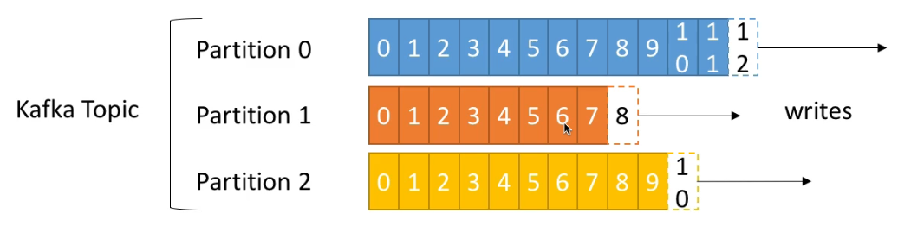
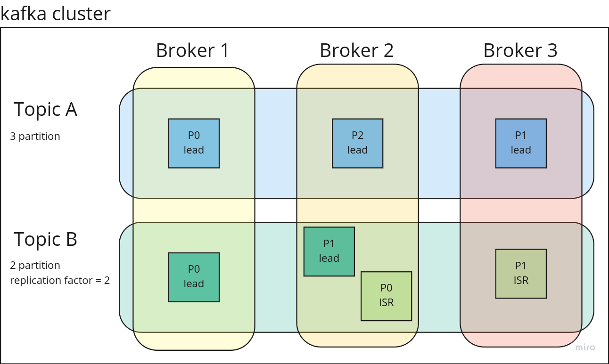
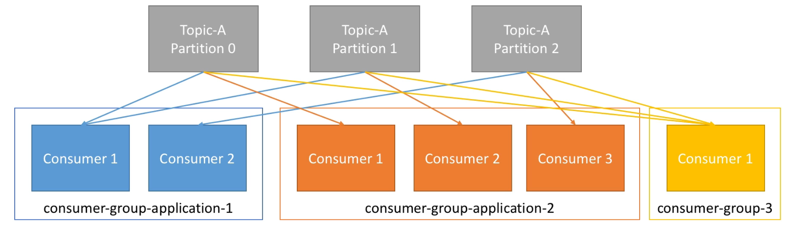

# Apache Kafka

#### resources:
1. [udemy course](https://www.udemy.com/course/apache-kafka/)
2. [Kafka: The Definitive Guide](https://www.amazon.com/Kafka-Definitive-Real-Time-Stream-Processing/dp/1491936169)

## kafka system design
* **message**: data to store on kafka (orderId:123) like rows in SQL db
  * messages are immutable after write
* **topic**: the name or label of messages (order:create) like tables in SQL db
* **partition**: each topic has multiple partitions
  * message assignments to partitions is handled by producer and is round-robin
  * if the messages have key all messages with same key go to the same partition
* **offset**: each message in a partition has a _unique_ and incremental id named offset
  * the incremental order is within each partition (not topic)
  * kafka keeps data for limited time (default 1 week). after delete offset will not get reset

* **broker**: servers (distributed systems)
* **kafka cluster**: multiple brokers
* **replication factor**: number of partitions with same data
  * 3 is safe and 2 is a bit risky
* **leader partition**: the only partition that can receive and serve data (master)
  * only one broker can be a leader for a given partition
* **ISR partition**: in-sync replica (slave)
  * other brokers are ISR

* **producer**: write data on topics
  * know which partition and broker to use
  * lead balancer
    * round-robin for messages without key
    * key-based: all keys go to same partition (key-hashing)
* **consumer**: read data from topic
  * know which broker to read from
  * read on order in each partition
* **consumer group**: each consumer group can have multiple consumers

